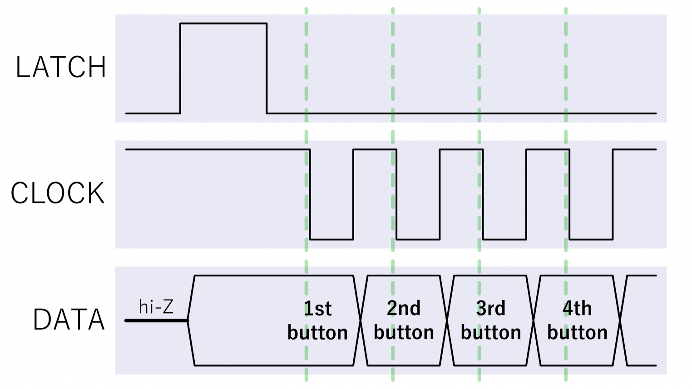
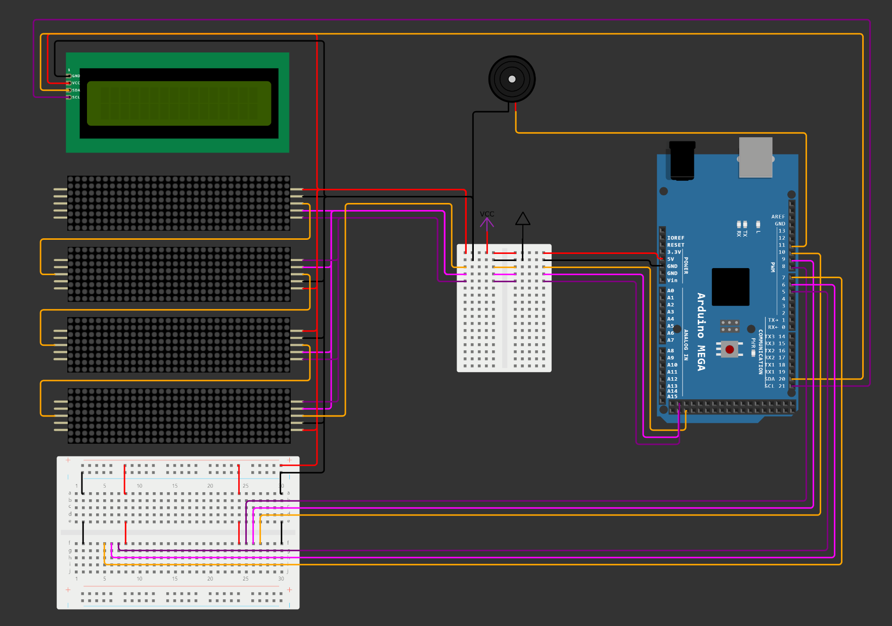

<!-- Table of contents -->
# Inhalt

- [Inhalt](#inhalt)
- [Kurzbeschreibung](#kurzbeschreibung)
- [Aufbau](#aufbau)
    - [Gehäuse](#gehäuse)
    - [LED-Matrix](#led-matrix)
    - [Mikrocontroller](#mikrocontroller)
    - [SNES-Controller](#snes-controller)
    - [Spannungsversorgung](#spannungsversorgung)
    - [I²C-LCD](#ic-lcd)
    - [Buzzer](#buzzer)
    - [Schaltplan](#schaltplan)

# Kurzbeschreibung

**Retris** ist eine Neuauflage des legendären Puzzlespiels Tetris, das darauf abzielt, das Retro-Gaming zu erneuern und gleichzeitig den Bedürfnissen moderner Spieler gerecht zu werden. Das Spiel wird mit einem Controller gesteuert, um das Gaming Spielerlebnis zu bewahren, während es gleichzeitig durch innovative Funktionen wie einen Zwei-Spieler-Modus und dem originalen Soundtrack ergänzt wird.

Das kompakte und tragbare Design macht Retris zu einem idealen Begleiter für unterwegs.

Retris baut auf dem Erbe des Originalspiels Tetris auf und strebt danach, die Welt des Retro-Gamings auf eine neue Ebene zu heben.

# Aufbau

Grundsätzlich ist der Retris Aufbau kompakt und einfach gehalten. Es besteht aus einem Gehäuse, indem sich der Mikrocontroller und die Verdrahtungen befinden. So werden die Verdrahtungen geschützt und es gibt ein  besseres Design. Außerdem beinhaltet das Gehäuse die LED-Matrix, die Controller-Anschlüsse, sowie das LCD (Liquid Crystal Display). An das Gehäuse werden dann zwei SNES-Controller, sowie ein USB-C Netzkabel angebracht.

### Gehäuse
Das Gehäuse ist ein 3D gefertigtes Konstrukt. Eine technische Zeichnung können Sie dem ``Engineering_Folder`` entnehmen. Es besteht aus drei einzelnen Teilen, die anschließend verschraubt worden sind, sodass sich Kabelbrüche o.ä. Fehler leicht beheben lassen. Auf dem einen Teil sind die vier LED-Matrizen festgelötet, sodass diese immer in einem Verbund sind. Die anderen beiden Teile stellen dann das eigentliche Gehäuse dar. Im Gehäusedeckel wurden einige Aussparungen vorgenommen, sodass man dort die entsprechenden Komponenten und Anschlüsse vom Gehäuseinneren sehen kann.

### LED-Matrix
<!--Eine Matrix besteht aus vier quadratischen LED's mit 8x8 LED's. Somit besteht ein Matrixverbund aus 8x32 LED's. 
Für die Realisierung von zwei Tetris Feldern haben wir vier dieser Verbünde mithilfe der Daisy-Chain Methode verbunden. 
Die LED's sind alle einheitlich in rot.-->

Das Spielfeld wird auf einer 32x32 Matrix, bestehend aus roten LEDs, dargestellt. Diese Matrix setzt sich zusammen aus vier einzelnen Modulen der Größe 8x32.
Ein Modul setzt sich zusammen aus vier Matrix Einheiten mit einer Anordnung von 8x8 LEDs und wird durch einen MAX7219 Treiber angesteuert. 
Die Ansteuerung der Matrix erfolgt über die SPI-Schnittstelle (Pins: 51, 52, 53) des Mikrocontrollers. Die Datenverbindung erfolgt ab Pin 51 per Daisy-Chain-Verbindung, in Reihe, zu den weiteren Modulen. Hierbei wird jeweils eine Verbindung von der DOUT (Data-out) Schnittstelle zur DIN (Data-In) des folgenden Moduls hergestellt.
Zusätzlich erhalten die Module jeweils ein Clock Signal (CLK) und ein Slave-Select (CS) Signal zur Ansteuerung. Beide Signale werden parallel gesendet.
Die Spannungsversorgung der Matrizen erfolgt durch den gemeinsamen Anschluss an die externe Spannungsquelle (5V).
Um beispielsweise die Helligkeit der LEDs zu steuern oder andere Anpassungen vorzunehmen, können im Code verschiedene Einstellungen verändert werden.

### Mikrocontroller

Für die Steuerung und der Logik der gesamten Systemarchitektur ist der Mikrocomputer zuständig. 
Hier haben wir auf ein klassisches Arduino-Kit mit einem Arduino MEGA zurückgegriffen. Dieses bietet bereits einige Bauteile und Leitungen die für unser Projekt nötig sind.
Die Wahl des Arduino MEGA mit dem Kern ATmega2560 war eine reine Vorsichtsmaßnahme um zu vermeiden, dass uns der Speicherplatz des Chips definitv ausreicht. Rückwirkend betrachtet war dies auch die richtige Entscheidung, da der Arbeitsspeicher eines Arduino UNO nicht für dieses Projekt ausgereicht hätte. Mit einem Verbrauch von etwa 16 Kilobyte Flash Speicher und 2,6 Kilobyte RAM, war der leistungsfähigere Mikrocontroller notwendig. Der Mikrocontroller bietet uns genügend digitale und analoge Pins, um die Ansteuerung der LED-Matrix, der beiden SNES-Controller, des Buzzers und des LCD zu realisieren. Das nachfolgende Bild zeigt die jeweiligen Speichergrößen der einzelnen Mikrocontroller. Die für uns wichtigen Daten sind die des "UNO Rev3" und die des "MEGA 2560 Rev3". Hier ist klar zu erkennen, dass der letztere deutlich mehr Speicher bietet und damit unsere Anforderungen erfüllt.
<!--  -->

### SNES-Controller
Ein absolutes Alleinstellungsmerkmal ist die Implementierung von SNES-Controllern. Mithilfe festgelegter Eingabetasten lassen sich die Blöcke bewegen drehen und das Spiel unterbrechen. Die gesamte Steuerung läuft über die Controller ab. Die Anschlüsse sind unterhalb der Matrix angebracht. Bei Fehlfunktionen oder Beschädigungen, lässt sich der Controller durch ``Plug & Play`` austauschen.
Für die Abfrage der Eingabe werden fünf Verbindungen benötigt. Diese bestehen aus Versorgungspannung und Erdung (Vcc , GND) und drei weiteren Leitungen um die Daten abzurufen (Data Clock, Data Latch, Serial Data). 
Erdung und Spannungsversorgung werden ebenfalls über die Externe Spannungsquelle (5V) bereitgestellt. Die Datenleitungen können individuell an drei digitale Pins des Mikrocontroller angeschlossen werden, dabei benötigt jeder Controller seine eigens im Code zugeordneten Pins.
Die Datenübertragung basiert auf einem Simplex-SPI Protokoll. Hierbei werden Daten nur in eine Richtung von einem Gerät zum anderen übertragen. Um ein Eingabesignal vom Controller zu erhalten, muss das Protokoll des SNES-Systems reproduziert werden.
Dabei wird mit einem High-Signal (5V) Puls auf dem Latch Pin die Abfrage gestartet. Daraufhin wird ein Clock-Signal erstellt das von High (5V) zu Low (0V) wechselt. Hierbei wird im Hintergrund vom Mikrocontroller mitgezählt, welcher Clockpuls in Abhängigkeit der Zeit auftritt. 
Sollte ein Knopf auf dem Controller gedrückt sein, wird das Data-Signal Low gesetzt und der Mikrocontroller kann die Information auslesen. Der Zeitpunkt, wann das Signal Low wird, ist entscheidend für die korrekte Interpretation der Eingabe. Das Signal wird für einen bestimmten Knopf zu einem bestimmten Zeitpunkt Low und kann somit durch das Zählen der Clocksignale definiert werden.
<!---->

Quellen:
[Circuitcellar](https://circuitcellar.com/research-design-hub/projects/interfacing-with-video-game-controllers/)
[Bitluni](https://bitluni.net/gamepad)

### Spannungsversorgung
Zu Anfang des Projekts standen verschiedene Möglichkeiten zur Spannungsversorgung zur Auswahl. Diese hat sich mit der Festlegung der einzelnen Komponenten auf eine einfache Lösung reduziert.
Wir entschieden uns, nach dem Abwägen der gegebenen Möglichkeiten, eine externe Spannungsquelle zu nutzen und diese per USB Typ-C Anschluss abnehmbar zu gestalten. 
Den Strom liefert ein handeslsübliches USB-Netzteil in Form eines Ladegerätes bekannt von Smartphones. Dieses liefert eine Spannung von 5 Volt und 3 Ampere Strom, sodass uns eine Leistung von 15 Watt zur Verfügung steht.
Eine weitere Möglichkeit die noch im Raum steht und bei einer zukünftigen Version des Projektes genutzt werden kann, ist die Integration einer Powerbank mit entsprechender Leistung. Diese könnte leicht in das Gehäuse integriert werden.
Hierzu müssten nur einige Anpassungen vorgenommen werden. Darunter zählt das Hinzufügen eines Ladeanschlusses und eines Schalters, um die Stromzufuhr beliebig zu beeinflussen.

### I²C-LCD
Das LCD (Liquid Crystal Display) ist im Gehäuse über der Matrix angebracht. Es besitzt zwei Zeilen, die den Punktestand der einzelnen Spieler anzeigen.
Die Ansteuerung des LCD erfolgt über die I²C-Schnittstelle (Pins: 20 SDA, 21 SCL) des Mikrocontrollers. Die Spannungsversorgung des LCD erfolgt durch den gemeinsamen Anschluss an die externe Spannungsquelle (5V).
Das LCD war Teil des Arduino Kits und wurde somit nicht extra angeschafft. 

### Buzzer
Ein Buzzer oder auf Deutsch "Summer", ist ein elektrisches Bauteil für akustische Signale. Mit einem Buzzer können Sie einen Summ- oder Piepton erzeugen. Dieser war ein Teil des Aurduino-Development Kits und musste somit nicht extra beschafft werden. Er wird im Gehäuse verbaut und gibt den bekannten Tetris Song wieder.
Die Ansteuerung des Buzzers erfolgt über einen digitalen PWM-Pin des Mikrocontrollers.

### Schaltplan

Der Schaltplan zeigt die Verkabelung der einzelnen Komponenten. Die Farben wurden wie folgt gewählt:
- Rot: Spannungsversorgung (5V)
- Schwarz: Erdung (GND)
- Orange: Datenleitungen
- Lila: Clock-Signale
- Pink: Latch/CS/SS-Signale

Der Schaltplan wurd mit Hilfe von Wokwi erstellt. Hierbei war es leider nicht möglich, die Schnittstellen für die Controller realitätsnah darzustellen. Daher wurde diese nur schematisch dargestellt.