# Retris - technische Dokumentation
Dieses Dokument zeigt den strukturellen Aufbau des Projektes "Retris" und die Gedanken hinter den Implementierungen. Die Dokumentation per Doxygen finden sie [hier](https://cndrw.github.io/2P-Tetris-Arduino/doxygen_output/html/index.html).

# Inhalt
- [Retris - technische Dokumentation](#retris---technische-dokumentation)
- [Inhalt](#inhalt)
  - [Rendering](#rendering)
    - [Interne Repräsentation des Displays](#interne-repräsentation-des-displays)
      - [Beispiele](#beispiele)
    - [Übertragung des internen Screens](#übertragung-des-internen-screens)
  - [Systemarchitektur](#systemarchitektur)
  - [OS-Struktur](#os-struktur)
    - [MenueHandler](#menuehandler)
    - [GameManager](#gamemanager)
  - [Spiellogik](#spiellogik)
    - [Zustandsmaschine](#zustandsmaschine)
    - [Kollisions Erkennung](#kollisions-erkennung)
    - [Fallgeschwindigkeit](#fallgeschwindigkeit)
  - [Input Management](#input-management)
  - [Musik](#musik)
    - [Aufbau der Notenliste](#aufbau-der-notenliste)
    - [Optimierung der Notenlängenberechnung](#optimierung-der-notenlängenberechnung)
    - [Setup des Timer](#setup-des-timer)
    - [Timer-Logik](#timer-logik)
  - [Watchdog](#watchdog)
    - [Implementierung](#implementierung)
  - [Zeit Messungen](#zeit-messungen)
    - [Messvorgehen](#messvorgehen)
    - [Messergebnisse](#messergebnisse)
    - [Beurteilung der Ergebnisse](#beurteilung-der-ergebnisse)
  - [Scheduling](#scheduling)
    

## Rendering
### Interne Repräsentation des Displays
Die Matrix, die zur Visualisierung genutzt wird, verfügt über 32x32 LEDs. Das heißt die interne Repräsentation muss es ermöglichen den Zustand aller 1024 LEDs abzuspeichern und zu verändern.

Durch unsere Wahl einer einfarbigen Matrix, kann jede LED mit nur einem Bit dargestellt werden (an oder aus). Dementsprechend wird das gesamte Display mittels eines simplen Array der Länge 32, welches 32-Bit Integer speichert, dargestellt. Dabei repräsentiert der Index des Arrays die Zeile und die Position des Bits innerhalb des Integers die Spalte (MSB -> Spalte 0). Die linke obere Ecke definiert den Koordinatenursprung. Des Weiteren steigt der y-Wert nach unten an.

```
Zeile |    | Spalte
----------------------------
      |    | 0 | 1 | 2 | 3 | . . .
0     | 0b | x | x | x | x |
1     | 0b | x | x | x | x |
2     | 0b | x | x | x | x |
.
.
.
```
#### Beispiele
```
// anschalten der linken oberen LED (0, 0)
screen[0] |= 0x8000'0000 // oder screen[0] |= (int32_t)1 << 31

// ausschalten der LEDs (5, 10) und (6, 10)
screen[10] |= 0x0C00'0000 // oder screen[10] |= (int32_t)2 << (31 - 6)
```

### Übertragung des internen Screens
Die [interne Darstellung des Displays](#interne-repräsentation-des-displays) kann leider nicht in dieser Form an die Matrizen übertagen werden. Die SPI-Übertragung besteht in diesem Fall aus vier Schritten:
1. Chip-Select auf LOW
2. senden um welche Zeile es handelt (`SPI.transfer(rowIndex)`)
3. senden welche LEDs in dieser Reihe welchen Zustand haben (`SPI.transfer(row)`)
4. Chip-Select auf HIGH

Dabei ist zu beachten, dass sich diese Schritte auf ein einzelnes LED-Modul des Displays beziehen. Dementsprechend kann man nur zwischen den Zeilen 1-8 auswählen und die Reihe wird Bit-Weise durch eine 8-Bit Zahl dargestellt. Das hat zur Folge, dass man bei einer Übertragung nur eine Zeile eines Modules auf einmal ändern kann. Um alle LEDs des Displays einmal neu zu zeichnen, müssen 128 (8 Zeilen * 16 Module) Übertragungen stattfinden. Eine letzte Besonderheit der Übertragung kommt durch das Daisy-Chaining. Um die Daten an das richtige Modul weiterleiten zu können, darf Chip-Select nicht auf HIGH gesetzt sein.  

Zur Realisierung der 128 Übertragungen wird eine Doppelte For-Schleife genutzt, wobei die äußere über die Anzahl der Zeilen eines Moduls iteriert und die innere über die Anzahl der Module.

```
for (int i = 0; i < ROWS; i++) {    // ROWS = 8
    digitalWrite(CS, LOW);
    for (int j = 0; j < SIZE; j++){     // SIZE = 16
        // ...
    }
    digitalWrite(CS, HIGH);
}
```


Das heißt, die erste Datenübertragung wird 16-mal weitergeleitet und landet letztenendlich bei dem letzten Modul. Danach ist Chip-Select auf HIGH und die nächste Zeile jedes Moduls kann übertragen werden. Durch die Anordnung der Matrizen sieht die Übertragungsreihenfolge dann folgendermaßen aus:
```
--------------------
| 1  | 2  | 3  | 4  |
--------------------
| 5  | 6  | 7  | 8  |
--------------------
| 9  | 10 | 11 | 12 |
--------------------
| 13 | 14 | 15 | 16 |
--------------------
```
Der letzte Schritt des Renderns ist die 32-Bit Integer Zahl, welche eine ganze Reihe repräsentiert, so zu zerlegen, dass zum richtigen Zeitpunkt die jeweiligen 8-Bit übertragen werden.
Zuerst muss deshalb die richtige Zeile ausgewählt werden. Die ersten vier Übertragungen senden die erste Zeile der LED-Matrix (Module 1-4) in jeweils 8-Bit Datenpaketen. Danach muss man im internen ``screen`` um 8 Zeilen springen (Module 5-8) und sendet wieder die gesamte Zeile. Als Folge würde der y-Wert des internen screens wie folgt aussehen: ```0,0,0,0, 8,8,8,8, 16,16,16,16, 24,24,24,24```. Das Verhalten lässt sich mittels einer Integer-Division erreichen.
```
// innerhalb der beiden For-Schleifen (siehe oben)
{
    // (j / 4) * 8 ergibt das Verhalten wie oben beschrieben
    // + i spezifiziert um welche Zeile vom 8x8 LED-Modul es sich handel
    row = screen[i + (j / 4) * 8]; // Y-Wert des screens
}
```


Dieses Bild stellt die Übertragungsreihenfolge an die LED-Matrix bildlich dar. Ein Feld symbolisiert hier eine 1x8 Zeile. Das Bild ist wie folgt zu lesen: Zuerst wird Rot übertragen, dann Grün, Dunkelblau, Hellblau, Gelb, Pink, Orange und zum Schluss Weiß. Außerdem wird von Hell nach Dunkel und anschließend von Oben nach unten übertragen. Demnach wird zuerst ganz oben das rote, helle Feld zuerst Übertragen, danach das rechts daneben, bis zum Dunkelsten, wonach die nächste Rote Zeile übertragen wird usw.

Aufgrund der Übertragungsreihenfolge müssen aus dem Integer, der eine Zeile repräsentiert, die vier höchstwertigen Bits (MSB) zuerst versendet werden und die vier niederwertigsten Bits (LSB) zuletzt. Das heißt die Zahl muss zuerst um 6 Byte nach rechts verschoben werden, danach um 4, dann um 2, wobei die vier LSB nicht extra verschoben werden müssen. Nachdem der ganze Integer zerteilt und übertragen wurde, muss dies von neu beginnen. Das Verhalten der Folge lässt sich mittels dem Modulo Operator verwirklichen.
```
// innerhalb der beiden For-Schleifen
{
    // nur die 4 LSB werden gespeichert, der Rest wird abgeschitten
    uint8_t dataToSend = currentRow >> ((6 - ((j % 4) * 2)) * 4)
}
```
Der Teil `(j % 4) * 2` ermöglicht die Folge: ``0,2,4,6,0,2,...`` Mit der `6 - ` davor erreichen wir die richtige Reihenfolge der Folge und die Multiplikation mit vier bewirkt die Byteverschiebung. Alles zusammen sieht dann wie folgt aus:
```
// innerhalb der beiden For-Schleifen
{
    uint8_t data = screen[i + (j / 4) * 8] >> ((6 - ((j % 4) * 2)) * 4);
    
    SPI.transfer(i + 1); // addressierung des moduls ist um eins verschoben
    SPI.transfer(data);
}
```
Diese Übertragung wird von der `DrawScreen`-Funktion ausgeführt und zeichnet am Ende jedes OS-Ticks den momentanen Zustand des internen `screen`.

## Systemarchitektur

In der nachfolgenden Grafik sieht man die allgemeine Systemarchitektur. Diese soll den schematischen Aufbau des Projekts aufzeigen und die entsprechenden Schnittstellen auf einen Blick kenntlich machen.


## OS-Struktur
An oberster Stelle der Instanzen ist [`RetrisOS`](https://cndrw.github.io/2P-Tetris-Arduino/doxygen_output/html/classRetrisOS.html). Es ist die ausführende Kraft in dieser Systemarchitektur. Es kann Prozesse initialisieren, updaten, einfrieren und den laufenden Prozess durch einen anderen ersetzen. Das sind die grundlegenden Funktionen die ein Prozess aufweisen muss, damit er ausgeführt werden kann. Realisiert wird das über das [`Process`](https://cndrw.github.io/2P-Tetris-Arduino/doxygen_output/html/classProcess.html)-Interface. Des Weiteren ist [`RetrisOS`](https://cndrw.github.io/2P-Tetris-Arduino/doxygen_output/html/classRetrisOS.html) zuständig für das Auslesen der momentanen Controllerzustände, sowie das Zeichnen des Frames am Ende des OS-Ticks.

Der grundsätzliche Ablauf ist, dass nach einlesen der Controllerzustände lediglich der momentane Prozess aktualisiert wird. Sollte der laufende Prozess geändert werden, muss nur der neue Prozess zuerst initialisiert werden, um danach in der `UpdateSystem`-Funktion regelmäßig aktualisiert zu werden. Demnach ist es für [`RetrisOS`](https://cndrw.github.io/2P-Tetris-Arduino/doxygen_output/html/classRetrisOS.html) irrelevant. Somit weist es ein sehr generisches Verhalten auf, was es sehr einfach macht neue Prozess zu implementieren, wie z.B. einen extra Modus.

[`RetrisOS`](https://cndrw.github.io/2P-Tetris-Arduino/doxygen_output/html/classRetrisOS.html) aktualisiert sein System dauerhaft in der Main-Loop. Dabei wird die Taktrate zusätzlich durch einen `delay` von 10 ms veringert. Das heißt die OS-Tick-Frequenz beträgt rund 100 Hz (Rohwert ohne Ausführungszeit des Systems). Demnach hat das Display eine Bildwiederholrate von ca. 100 Hz.


**HINWEIS**: Um die Informationsdichte zu reduzieren wurden nicht alle Methoden und Variablen in diesem Diagramm eingetragen.

### MenueHandler
Eine Instanz mit dem `Process`-Interface ist der [`MenueHandler`](https://cndrw.github.io/2P-Tetris-Arduino/doxygen_output/html/classMenueHandler.html). Dieser ist verantwortlich die richtigen Menüs anzuzeigen. Da der [`MenueHandler`](https://cndrw.github.io/2P-Tetris-Arduino/doxygen_output/html/classMenueHandler.html) ein Prozess ist, kann dieser alle Aufgaben wie in der [OS-Struktur](#os-struktur) beschrieben, ausführen. Das Einfrieren von Menüs wird nicht benötigt, weshalb diese Funktionalität ungenutzt bleibt.

Der [`MenueHandler`](https://cndrw.github.io/2P-Tetris-Arduino/doxygen_output/html/classMenueHandler.html) wurde mit dem Strategie Design-Pattern entworfen, da alle Menüs in den Grundzügen gleich funktionieren, jedoch trotzdem leicht anderes Verhalten in der Ausführung aufweisen.


**HINWEIS**: Um die Informationsdichte zu reduzieren wurden nicht alle Methoden und Variablen in diesem Diagramm eingetragen.


Um das zu realiseren gibt es das [`Menue`](https://cndrw.github.io/2P-Tetris-Arduino/doxygen_output/html/classMenue.html)-Interface, welches die Grundfunktionalität jedes Menüs vorgibt. Darunter fallen die Methoden `RefreshMenue`, `PushButton` und `ButtonSelect`.

**HINWEIS**: Um die Informationsdichte zu reduzieren wurden nicht alle Methoden und Variablen in diesem Diagramm eingetragen.

### GameManager
Der [`GameManager`](https://cndrw.github.io/2P-Tetris-Arduino/doxygen_output/html/classGameManager.html) ist die zweite Instanz, welche ein ausführbarer Prozess ist. Er steuert die Ausführung des eigentlichen Gameplays ([`RetrisGame`](https://cndrw.github.io/2P-Tetris-Arduino/doxygen_output/html/classRetrisGame.html)), je nachdem welcher Modus ausgewählt worden ist (1-Spieler oder 2-Spieler). An der Steuerung des Spielgeschehens ist er jedoch nicht beteiligt, sondern steuert nur die Initialisierung der Spielinstanzen, das Zwischenspeichern des Spielfeldes und reagiert auf bestimmte aufkommende Spielzustände der jeweiligen Spielinstanzen. Des Weiteren ist er für das Wechseln in das Pausenmenü und das Starten der Musik verantwortlich, da dies Funktionen unabhängig von der Spieleranzahl sind und nicht zur eigentlichen Spiellogik von [`RetrisGame`](https://cndrw.github.io/2P-Tetris-Arduino/doxygen_output/html/classRetrisGame.html) gehören.


**HINWEIS**: Um die Informationsdichte zu reduzieren wurden nicht alle Methoden und Variablen in diesem Diagramm eingetragen.

## Spiellogik

Die gesamte Spiellogik ist innerhalb der [`RetrisGame`](https://cndrw.github.io/2P-Tetris-Arduino/doxygen_output/html/classRetrisGame.html)-Klasse implementiert Dabei ist ein Objekt dieser Klasse für genau ein Spielfeld zuständig. Die Spiellogik entspricht im Allgemeinen genau der orignalen Tetris Spiellogik.


**HINWEIS**: Um die Informationsdichte zu reduzieren wurden nicht alle Methoden und Variablen in diesem Diagramm eingetragen.

### Zustandsmaschine
Das Spiel wurde bei unserem System in fünf Spielzustände eingeteilt.

Der "Normal"-Zustand ist dabei der `Playing`-Zustand. Dieser repräsentiert den ganz normalen Spielablauf, d.h. ein Block fällt herunter. Wenn der Block gelandet ist, wird nach einer vollen Reihe gesucht. Ist eine neue volle Reihe entstanden, so wird in den `Animation`-Zustand gewechselt. Dieser ist verantwortlich die Clear-Animation abzuspielen, das Level und die Fallgeschwindigkeit anzupassen, sowie die Punkteanzeige des LCD-Displays zu aktualisieren und letztendlich den neuen Block zu generieren. Sollte beim Generieren eines neuen Blocks erkannt werden, dass dieser nicht platziert werden kann, da dass Spielfeld voll ist, so gilt die Runde als verloren. Daher wird zum `Lost`-Zustand gewechselt, welcher lediglich die Game-Over-Animation abspielt und anschließend in den `Finished`-Zustand wechselt. Im `Finished`-Zustand passiert nichts (Spiel wird nicht aktualisiert) und wird als Signalisierung des Spielendes für den [`GameManager`](https://cndrw.github.io/2P-Tetris-Arduino/doxygen_output/html/classGameManager.html) benutzt. Der letzte Zustand ist der `Wait`-Zustand. Dieser ist lediglich dafür da, eine Verzögerung zu erzeugen (Verzögerung zwischen landen des Blockes und dem Generieren). Aufgrunddessen, dass diese Funktionalität nur in einer Situation benötigt wird, ist diese auch nur rudimentär implementiert (nicht generisch). 


Auch wenn von "Blöcken generieren" gesprochen worden ist, ist dies nur um dem, was vermeintlich auf dem Spielfeld passiert, treu zu sein. Denn [`RetrisGame`](https://cndrw.github.io/2P-Tetris-Arduino/doxygen_output/html/classRetrisGame.html) hat immer den selben Block, welcher nachdem er gelandet ist lediglich zurückgesetzt wird und eine andere Form annimmt. Dadurch muss kein Objekt zur Laufzeit erstellt werden. Des Weiteren wurde die Animationen iterativ implementiert, d.h. die Funktionen sind abhängig davon, welche Tick-Anzahl gerade herrscht (wird jeden OS-Tick aufgerufen). In einer zukünftigen Version könnten diese Animationen mittels Timern realisert werden. Diese Betrachtung kam für die momentane Retris Version leider zu spät in der Entwicklung.

### Kollisions Erkennung

Die Kollisionerkennung erfolgt bei [`RetrisGame`](https://cndrw.github.io/2P-Tetris-Arduino/doxygen_output/html/classRetrisGame.html) nach dem einfachen Prinzip, dass aktive Pixel (LEDs) blockieren und inaktive Pixel nicht blockieren. Durch dieses einfache Verfahren können gesetzte Blöcke lediglich auf dem Bildschirm "liegen gelassen" werden, d.h. man muss keine zustätzlichen Daten für die Kollisionauswertung speichern. Es reicht schon den aktuellen Zustand des internen `screen` auszulesen.

Das technische Vorgehen, ob die gewünschte Bewegung des Blockes auch zulässig ist, ist ebenso simpel gehalten. Die Bewegung wird probeweise ausgeführt. Sollte es dann im Vergleich mit den gesetzten Pixeln im `screen`, dazu kommen, dass diese Bewegung auf einem Pixel landen würde, welcher schon aktiv ist, so wurde eine Kollision erkannt.

### Fallgeschwindigkeit

Bei dem Verlauf der Fallgeschwindigkeit des Blocks unterscheidet sich Retris von dem originalem Tetris. In Tetris gibt es keine kontinuierliche Geschwindigkeitserhöhung, d.h. nicht mit jedem Level wird sich die Fallgeschwindigkeit erhöhen. Um einen angenehmen Verlauf der Schwierigkeit zu haben, haben wir uns dazu entschieden, die Fallgeschwindigkeit kontinuierlich pro Level zu erhöhen. Dabei sollte trotzdem ein gewisser Grad von exponentiellem Wachstum in der Geschwindigkeitsveränderung sein. Des Weiteren entspricht die Fallgeschwindigkeit in [`RetrisGame`](https://cndrw.github.io/2P-Tetris-Arduino/doxygen_output/html/classRetrisGame.html) genau dem Faktor, um welchen die Spielinstanz langsamer als [`RetrisOS`](https://cndrw.github.io/2P-Tetris-Arduino/doxygen_output/html/classRetrisOS.html) (OS-Tick) aktualisiert wird. Das heißt, soll die Geschwindigkeit erhöht werden, so muss die eigentliche Variable verringert werden. Dabei ergibt sich für die Fallgeschwindigkeit in Abhängigkeit des Levels folgende Gleichung:

$f(x) = 40 - e^3 - e^{0.0366\cdot x + 3} \qquad x \ \hat{=} \ Level $

Die Paramter $ 40 - e^3$ und $0.0366$ ergaben sich dabei aus den folgenden Bedingungen:
- Anfangsgeschwindigkeit : $f(0) = 40$
- Maximalgeschwindigkeit: $f(29) = 2$

Nach dem Level 29 folgen keine weiteren Geschwindigkeitserhöhungen. Da die Fallgeschwindigkeit nur ganzzahlige Werte annehmen kann, werden alle berechneten Ergebnisse aus der Formel abgerundet. Schließlich sind auch die Geschwindigkeiten für alle Level zur Compile-Time bekannt, d.h. man kann die aufwendigen Berechnungen umgehen, indem man diese vorher berechnet und in einem Look-Up-Table (Array) definiert.

## Input Management

Der Basiscode für das Einlesen der Controllereingaben, stammt aus dem Repository von [glumb](https://github.com/burks10/Arduino-SNES-Controller/tree/master/controller_test). Es wurden Anpassungen vollzogen, damit dieser Code zu unserem Projekt passt und vorallem das Einlesen von zwei angeschlossen Controllern erlaubt.

Das Auslesen der Controllereingaben erfolgt über eine Funktion, welche periodisch in der `UpdateSystem`-loop von [`RetrisOS`](https://cndrw.github.io/2P-Tetris-Arduino/doxygen_output/html/classRetrisOS.html) ausgeführt wird. Es wurde sich bewusst gegen eine Implementierung mittels Timer entscheiden, da es keine ersichtlichen Vorteile zu bieten hat. Dadurch, dass diese Funktion in der `UpdateSystem`-loop steht, wird sie alle ca. 10 ms (Basis OS-Tick Dauer) aufgerufen und somit der momentane Zustand des Controllers alle 10 ms aktualisiert. Die menschliche Reaktion liegt maximal bei 130 ms bzw. ist deutlich höher als die momentane Abfragerate. Ebenfalls würde eine höhere Abfragerate durch einen Timer den Mikrocomputer mehr auslasten, obwohl kein Unterscheied beim Spielerlebnis erkennbar ist. Die Vermutung, dass die Abfragerate schnell genug ist, damit man keine Verzögerung spürt, ließ sich auch durch Spieletests bekräftigen.


## Musik
Die Musik in Retris wird über einen Piezo-Buzzer realisiert. Die Basis des Codes, der für die Musik zuständig ist kommt von [robsoncoutu](https://github.com/robsoncouto/arduino-songs/tree/master), jedoch wurden einige Änderungen vorgenommen, um die Performance zu erhöhen, welche in den folgenden Kapiteln erläutert werden.


### Aufbau der Notenliste
Um eine Note abzuspielen benötigt man für diesen Fall zwei Informationen:
1. Die Frequenz die gespielt werden soll (welche Note)
2. Den Notenwert (halbe Note, viertel Note, ...)

Der Author des Basiscodes ([robsoncoutu](https://github.com/robsoncouto/arduino-songs/tree/master)) hat dabei entschieden diese Informationen in einem `melody` Array zu verpacken.\
Der Aufbau ist wie folgt:
```
uint32_t melody[] = { NOTE_1, NOTENWERT, NOTE_2, NOTENWERT, ... }
```
Des Weiteren sind die Notenwerte wie folgt codiert:
 - 2 => halbe Note
 - 4 => viertel Note 
 - 8 => achtel Note
 - negative Zahlen repräsentieren punktierte Noten (z.B. -4)

Um vom Notenwert auf die Notenlänge zu kommen, wird eine ganze Note durch diesen Notenwert dividiert.
```
uint8_t tempo = 144; 
// this calculates the duration of a whole note in ms (60s/tempo)*4 beats
uint32_t wholeNote = (60000 * 4) / tempo;
uint32_t noteDuration = wholeNote / abs(divider);
```

### Optimierung der Notenlängenberechnung 
Eine Besonderheit die bei der Berechnung der Notenlängen auffällt ist, dass es alles Berechnungen sind, die man schon vor dem ausführen des Codes weiß. Daher ist eine einfache Optimierung die man vornehmen kann, anstatt den Notenwert im Array abzuspeichern, die Notenlänge direkt anzugeben. Um das zu realisieren, mussten lediglich eine `constexpr` Funktion, welche die Berechnungen schon zur Compile-Zeit macht und damit die Notenwerte in Notenlänge direkt konvertiert. Im Code sieht es dann wie folgt aus:
```
constexpr uint8_t tempo = 144; 
constexpr uint32_t wholeNote = (60000 * 4) / tempo;
constexpr uint32_t Convert(int8_t noteValue)
{
    return noteValue == -4 ? (wholeNote / 4) * 1.5 : (wholeNote / noteValue);
}

constexpr uint32_t melody[] = { NOTE_1, Convert(4), NOTE_2, CONVERT(8), ...}
```
Die -4 ist die einzige gepunktete Note die im Lied vorkommt. Daher kann man die Überprüfung nach gepunkteten Noten so vereinfachen.
Wie man sieht wurden damit nicht nur Berechnungen gespart sondern auch ein if-else-Zweig im Timer.

### Setup des Timer
Als erstes musste ein passender Timer-Mode gefunden werden. Kriterien für die Auswahl dabei waren:
 -  Modus ist Fast-PWM (Pulsweitenmodulation)
 -  TOP (also wann der Timer resettet) muss über ein Output Compare Register festlegbar sein

Dadurch fiel die Wahl auf den Modus 15 (WGM10-WGM13 = HIGH), welcher im Fast-PWM operiert und man TOP durch das Register OCR1A setzten kann.

Der Vorteiler musste im Idealfall so gelegt werden, dass jede benötigte Frequenz nur durch das Anpassen des OCR1A-Registers erzielt werden kann. Diese Anforderung erfüllen allerdings alle Vorteiler außer die zwei Kleinsten. Daher fiel die Wahl arbiträr auf den Vorteiler 256.

Zu guter letzt muss noch in dem Timer-Interrupt-Mask-Register das Flag OCIE1A gesetzt werden, welches dafür sorgt, dass ein Interrupt ausgeführt wird, wenn der Timer/Counter den Wert im Output-Compare-Register (OCR1A) erreicht.

### Timer-Logik
Jedes [`Melody`](https://cndrw.github.io/2P-Tetris-Arduino/doxygen_output/html/structAudio_1_1Melody.html) Objekt verfügt über eine Zählervariable `currentNote`, welche die momentane Note der Audio repräsentiert. Das heißt der Timer weiß beim ausführen schon, welche Note gespielt wird. Daher kann als erstes die Notenlänge aus dem `melody` Array extrahiert werden (Index: `currentNote + 1`). Danach muss die `holdTime` berechnet werden, als die Zeit, wie lange der Ton gehalten werden soll. Die momentane Note bestimmt die Frequenz mit der der Timer fungiert. Um also herauszufinden, wie viele Timer-Ticks benötigt werden, muss man lediglich die Frequenz der momentanen Noten mit der Notenlänge (in s) multiplizieren. Damit hat man die Anzahl an Timer-Ticks, in denen der Timer "wartet". Da der Timer nicht einfach so warten kann wird lediglich der Timercode in eine if-Bedingung gesteckt. Diese checkt ob der Zähler für den Timer (Variable `iInterrupt`) größer als die `holdTime` ist, wenn ja wird der nächste Ton gespielt, falls nicht wird der Zähler erhöht.
```
ISR(TIMER_COMPA_vect)
{
    if (interruptCount > holdTime) {
        // play Note
        interruptCount = 0;
    }
    else {
        interruptCount++;
    }
}
```
Nach der `holdTime` Berechnung wird die Variable `top` berechnet, die letztendlich den Wert im Output-Compare-Register annehmen wird. Der letzte Schritt in der Routine ist es den `currentNote` Zähler um zwei zu erhöhen. Falls die abgespielte Melodie in einer Endlosschleife wiedergegeben werden soll, gibt es eine zusätzliche if-Abfrage, die überprüft, ob das Ende der Melodie erreicht wurde. In diesem Fall wird `currentNote` wieder auf Null zurückgesetzt.

## Watchdog

Um zu vermeiden das während des Betriebs ein unvorhergesehener Bug auftritt, der das System sehr belastet bzw. im schlimmsten Fall in eine Endlosschleife führt, wurde ein Watchdog eingeführt. Dieser führt einen Systemreset durch, sobald er für mehr als vier Sekunden **nicht** zurückgesetzt worden ist. Damit landet der Spieler wieder im Hauptmenü.

### Implementierung 

 Die Einstellung des Watchdogs erfolgt über das `WDTCSR` Register (Watchdog Timer Control Register). Um die Time-out Konfiguration zu ändern ist laut Datenblatt angegeben, dass in der selben Operation das Bit `WDCE` (Watchdog Change Enable) und `WDE` (Watchdog System Reset Enable) gesetzt werden muss. Danach muss man in den nächsten vier Clock-Zyklen die `WDP`-Bits (Watchdog Prescaler) setzen, sowie das `WDE`-Bit nochmals, da der Watchdog bei uns die Aufgabe des Resettens hat. Abiträr wurde die Time-Out-Zeit von vier Sekunden gewählt (`WDP3` high), da das System in der Main-Loop alle ca. 10 ms ausgeführt wird und eine Nichtausführung von 4 s ein deutliches Problem signalisiert.

```
  WDTCSR |= (1 << WDCE) | (1 << WDE); // watchdog change enable - as demanded by the datasheet
  WDTCSR = (1 << WDE) | (1 << WDP3); // after 4s - system reset
```

Das Resetten des Watchdogs erfolgt über eine Inline Assembly.
```
asm("WDR"); // reset watchdog
```


## Zeit Messungen

### Messvorgehen

Zur Messung der Zeit an sich, wurde die vom Arduino bereitgestellte Funktion `micros` benutzt, welche die Zeit in Mikrosekunden seit dem Starten des Mikrocomputers ausgibt. Aufgrunddessen, dass das Retris Betriebssystem und das Retris-Gameplay an sich sehr viele bedingte Anweisungen (if-/switch-statement) hat, sprengt eine Messung aller Möglichkeiten den Rahmen dieser Arbeit. Daher wurde in folgenden Messungen nur die Durschnittszeiten eines Prozesses (z.B. `MainMenue`) gemessen, sowie der Worst-Case. Jede Messung ging über einen Zeitraum von 30 Sekunden. Gemessen wurde dabei die `UpdateSystem`-Funktion in der Main-Loop (mit dem jeweiligen Prozess aktiv). Nur für die Messung der `DrawScreen`-Funktion und dem Audio-Timer musste das vorgehen leicht verändert werden.

```
void loop {
    // Start der Messung
    retris.UpdateSystem();
    // Ende der Messung
}
```

### Messergebnisse 

Die Messergebnisse lassen sich in der Datei 'Time Measurements' einsehen. Zu erwähnen ist, dass die Menüs und auch [`RetrisGame`](https://cndrw.github.io/2P-Tetris-Arduino/doxygen_output/html/classRetrisGame.html) (größtenteils) gedrosselt werden. Sie werden nicht mit jedem OS-Tick geupdated, sondern beispielhaft nur jeden dreißigsten. Dadurch fallen die Durschnittszeiten relativ klein aus. Bei den Menüs ist zu erkennen, dass der Worst-Case jedoch nicht weit von dem Average-Case abweicht. Dementgegen tauchen bei manchen Messungen des Ein- und Zweispielermodus starke Worstcase-Spitzen auf, welche sogar den nächsten OS-Tick um ca. 16 zusätzliche Millisekunden verzögern können. Diese Spitzen werden durch das Senden an das LCD-Display verursacht, d.h. sie treten jedes mal auf, wenn der Spieler eine volle Reihe auflöst. In den Messungen, bei denen keine volle Reihe endstanden ist, kann man erkennen, dass auch der Worstcase nicht sonderlich stark vom Average abweicht.

### Beurteilung der Ergebnisse

Auch wenn die Worstcase-Spitzen, ausgelöst durch das LCD-Display, eine große Abweichung von den herkömmlichen Zeiten darstellt, sehen wir darin keine große Gefahr. Sie entstehen nur beim Aktualisieren des LCD-Displays, also nur wenn man eine volle Reihe aufgelöst hat. Des Weiteren sollte auch durch die zusätzliche Verzögerung bei **einem** Frame (Worstcase ca. 38 ms) die Aktualisierungsrate des Matrix-Displays und das Einlesen der Controllerzustände immernoch deutlich unter der menschlichen Reaktionszeit liegen und damit nicht bemerkbar sein.


## Scheduling

Eine Notwendigkeit für Scheduling war für dieses Projekt nicht wirklich von Bedeutung. Da sich die gesamte Spiellogik in der Main-Loop befindet und ebenfalls aufeinander aufbaut, d.h. es macht nur wirklich Sinn alles nacheinander, aufeinmal auszuführen. Das einzige Modul, das dem nicht entspricht ist dabei das [`Audio`](https://cndrw.github.io/2P-Tetris-Arduino/doxygen_output/html/namespaceAudio.html) Modul, da dieses über einen Timer läuft. Da die Musik nebenbei läuft und keine Abhängigkeit gegenüber des Hauptsystems (und vice verca) hat, gibt es keinen Anlass die Ausführung des Prozesses zu planen (schedule). Die Main-Loop wird lediglich immer mal kurz unterbrochen werden, um eine neue Note zu spielen. 
