# Retris - technische Dokumentation
Diese Dokument zeigt den strukturellen Aufbau des Projektes "Retris" und die Gedanken hinter den Implementierungen. Eine genauere Dokumentation des Quellcodes finden sie [hier](https://www.youtube.com/watch?v=dQw4w9WgXcQ).

# Inhalt
- [Hardware](#hardware)
    - [Display](#display)
- [Rendering](#rendering)
    - [interne Repräsentation des Displays](#interne-repräsentation-des-displays)
    - [Übertragung des internen Zustands](#übertraung-des-internen-screen)
- [OS-Struktur](#os---struktur)
    - [Processes](#processes)
    - [MenueHandler](#menuehandler)
    - [GameManager](#gamemanager)
- [Spiellogik](#spiellogik) 
    - [Input Management](#input-management)
    - [Kollisions Erkennung](#collision-detection)
    - [Full-Line Erkennung](#full-line-detection)
- [Musik](#music)
    - [Aufbau der Notenliste](#aufbau-der-notenliste)
    - [Setup des Timer](#setup-des-timer)
    - [Timer-Logik](#timer-logik)
    - [Performance](#perfomance)
    


## Hardware
### Display -Matrix 32x32
Das Display hat eine gesamt größe von 32x32 LEDs, welche aus 16 verschiedenen 8x8 LED-Modulen zusammengesetzt ist. Diese einzelnen Module sind per Daisy-Chain verbunden.


## Rendering
### interne Repräsentation des Displays
Die Matrix die zur visualiserung genutzt wird verfügt über 32x32 LEDs, dass heißt die interne Repräsentation muss es ermöglichen den Zustand aller 1024 LEDs abzuspeichern und zu verändern.

Aufgrund dessen, dass unsere gewählte Matrix einfarbig ist, kann jede LED einfacherweise mit nur einem Bit dargestellt werden (an oder aus). Dementsprechen wird das gesamte Display mittels einem simplen Array der Länge 32, welches 32-Bit Integer speichert dargestellt. Dabei representiert der Index des Arrays die Zeile und die Position des Bits innerhalb des Integers die Spalte (MSB -> Spalte 0). Der Koordinaten Ursprung wurde als die linke obere Ecke definiert, des Weiteren steigt der y-Wert nach unten an.

```
                x
 _ _|_ _ _ _ _ _ >
    |
    |
 y  u
```

```
Zeile |    Spalte
----------------------------
      |    | 0 | 1 | 2 | 3 | . . .
0     | 0b | x | x | x | x |
1     | 0b | x | x | x | x |
2     | 0b | x | x | x | x |
.
.
.
```
#### Beispiele
```
// anschalten der linken oberen LED (0, 0)
screen[0] |= 0x8000'0000 // oder screen[0] |= (int32_t)1 << 31

// ausschalten der LEDs (5, 10) und (6, 10)
screen[10] |= 0x0C00'0000 // oder screen[10] |= (int32_t)2 << (31 - 6)
```

### Übertragung des internen Screens
Die [interne Darstellung des Displays](#interne-Repräsentation-des-displays) kann leider nicht in dieser Form an die Matrizen übertagen werden. Die SPI-Übertragung besteht in diesem Fall aus vier Schritten:
1. Chip-Select auf LOW
2. senden um welche Zeile es handelt (`SPI.transfer(row)`)
3. senden welche LEDs in dieser Reihe welchen Zustand haben (`SPI.transfer(reihe)`)
4. Chip-Select auf HIGH

Zu beachten dabei ist, dass sich diese Schritte auf ein einzelnes [LED-Modul](#display) des Displays bezieht. Dementsprechend kann man nur zwischen der Zeilen 1-8 auswählen und die Reihe wird Bit-Weise durch eine 8-Bit Zahl dargestellt. Das hat zur folge, dass man bei einer Übertragung nur eine Zeile eines Modules auf einmal ändern kann. Um also alle LEDs des Display einmal neu zu zeichnen, müssen 128 (8 Zeilen * 16 Module) Übertragungen stattfinden. Eine letzte besonderheit der Übertragung kommt durch das Daisy-Chaining. Um die Daten an das richtige Modul durchzureichen, darf Chip-Select nicht auf HIGH gesetzt wird.  

Um alle LEDs neu zu zeichnen, müssen 128 Übertragungen stattfinden. Dies wird durch eine Doppelte For-Schleife erreicht, wobei die äußere über die Anzahl der Zeilen eines Moduls iteriert und die inner über die Anzahl der Module.

```
for (int i = 0; i < ROWS; i++) {    // ROWS = 8
    digitalWrite(CS, LOW);
    for (int j = 0; i < SIZE; j++){     // SIZE = 16
        // ...
    }
    digitalWrite(CS, HIGH);
}
```


Dass heißt, die erste Datenübertragung wird 16 mal durchgeschoben und landet letztenendlich bei dem letzten Modul. Danach ist Chip-Select auf HIGH und die nächste Zeile jedem Moduls kann übertragen werden. Durch den Anordnung der der Matrizen sieht die Übertragungsreihenfolge dann so aus:
```
--------------------
| 1  | 2  | 3  | 4  |
--------------------
| 5  | 6  | 7  | 8  |
--------------------
| 9  | 10 | 11 | 12 |
--------------------
| 13 | 14 | 15 | 16 |
--------------------
```
Der letzte Schritte des Renderns, ist es die 32-Bit Integer Zahl, welche eine ganze Reihe representiert, so zu zerlegen, dass zum richtigen Zeitpunkt die jeweiligen 8-Bit übertragen werden.
Zuerst muss deshalb die richtige Reihe ausgewählt werden. Die erste Übertragung sendet die erste Zeile in jeweils 8-Bit teilen, danach muss man im internen screen um 8 Zeilen springen und sendet wieder die gesamte Reihe. Als Folge würde der y-Wert des internen screens wie folgt aussehen: 0,0,0,0,8,8,8,8,16,16,16,16,24,24,24,24. Das Verhalten lässt sich mittels einer Integer-Division erreichen.
```
// innerhalb der beiden For-Schleifen
{
    // (j / 4) * 8 ergibt das Verhalten wie oben beschrieben
    // + i spezifiziert um welche Reihe vom 8x8 LED-Modul es sich handel
    row = screen[i + (j / 4) * 8]; // Y-Wert des screens
}
```


Diese Bild stellt die Übertragungsreihenfolge der internen Repräsentation bildlich da. Das Bild ist wie folgt zu lesen. Zuerst wird Rot übertragen, dann Grün, Dunkelblau, Hellblau, Gelb, Pink, Orang und zum Schluss Weiß. Außerdem wird von Hell nach Dunkel und anschließend von Oben nach unten übertragen. Demnach wird zuerst ganz oben das rote, helle Feld zuerst Übertragen, danach das rechts daneben, bis zum Dunkelsten, wonach die nächste Rote Zeile übertragen wird.


Aufgrund der Übertragungsreihenfolge, muss aus dem Integer der eine Zeile representiert die vier MSB zuerst versendet werden und die vier LSB zuletzt. Dass heißt der Zahl muss zuerst um 6 Byte nach rechts verschoben werden, danach um 4, dann um 2 und die vier LSB müssen nicht extra verschoben werden. Nachdem der ganze Integer zerteilt und übertrage wurde, muss dies von neu beginngen. Diese Folgen verhalten lässt sich mittels dem Modulo Operator verwirklichen.
```
// innerhalb der beiden For-Schleifen
{
    // nur die 4 LSB werden gespeichert, der Rest wird abgeschitten
    uint8_t dataToSend = currentRow >> ((6 - ((j % 4) * 2)) * 4)
}
```
Der Teil `(j % 4) * 2` ermöglicht die Folge: 0,2,4,6,0,2,... Mit der `6 - ` davor erreichen wir die richtige Reihenfolge der Folge und die Multiplikation mit vier bewirkt die Byte verschiebung. Alles zusammen sieht dann wie folgt aus:
```
// innerhalb der beiden For-Schleifen
{
    uint8_t data = screen[i + (j / 4) * 8] >> ((6 - ((j % 4) * 2)) * 4);
    
    SPI.transfer(i + 1); // addressierung des moduls ist um eins verschoben
    SPI.transfer(data);
}
```
Dies Übertragung wird von der `DrawScreen` funktion ausgefürht, diese zeichnet nach jedem OS-Tick den momentan Zustand des internen `screen`.


## OS-Struktur
An oberster Stelle der Instanzen ist `RetrisOS`, es ist die ausführende Kraft in dieser Systemarchitektur. Es kann Prozesse initialisieren, updaten, einfrieren und den laufenden Prozess durch einen anderen ersetzten. Das sind die grundlegenden Funktionen die ein Prozess aufweisen muss, damit er ausgeführt werden kann. Realisiert wird das über das `Process`-Interface. 


### MenueHandler
Eine Instanz mit dem `Process`-Interface ist der `MenueHandler`, dieser ist Verantwortlich die richtigen Menüs anzuzeigen. Da es ein Prozess ist, kann es auch alle Aufgaben wie in der [OS-Struktur](#os-struktur) genannt, da das einfrieren von Menüs allerdings nicht benötigt wird, ist diese Funktionalität leer.

Der `MenueHandler` wurde mit dem Strategie Design Pattern entworfen, da alle Menüs in den Grundzügen gleich funktionieren, aber trotzdem leicht anderes Verhalten in der Ausführung haben.


Um das zu realiseren gibt es das `Menue`-Interface, welches die Grundfunktionalität jedes Menüs vorgibt. Darunter fallen die Methoden `RefreshMenue`, `PushButton` und `ButtonSelect`.

<!-- 
`RefreshMenue` zeichnet das Menue erneut, mit evtl. Veränderungen.\
`PushButton` führt die Funktion des (virtuellen) Knopfes (auf dem Display) aus, je nachdem welcher Knopf gerade ausgewählt ist.\
`ButtonSelect` wählt den nächsten Knopf aus.

Über die `AddMenue` Methode können einfach Menüs hinzugefügt werden, die das `Menue`-Interface haben. In der momentanen Implementierung ist die maximal Anzahl an Menüs die verwaltet werden auf drei beschränkt(Hauptmenü, Pausenmenü, Game-Over-Menü). -->

### GameManager
Der `GameManager` ist die zweite Instanz welche ein ausführbarer Prozess ist. Er steuert die Ausführung des eigentlichen Gameplays (`RetrisGame`), je nachdem welcher Modus ausgewählt worden ist (1-Spieler oder 2-Spieler). An der Steuerung des Spielgeschehens ist er jedoch nicht, sondern reagiert nur auf bestimmte aufkommende Spielzustände.


<!-- 
Bei der Initialisierung des Prozesses (`Init`) wird eine Startsequenz gestartet, welche die Worte "Auf die Blöcke, fertig, lost" nacheinander mit einer kurzen Verzögerung zeigt. Danach wird der Initialisierungsvorgang der Spielsitzung(en) ausgeführt.

Im `Update` werden lediglich die Spielsitzung(en) aktualisiert. Des Weiteren wird der momentane Zustand der Spielsitzung(en) ausgelesen und sollten beide im Zustand `GAME_STATE_FINISHED` sein wird der Systemprozess zum `MenueHandler` gewechselt, welcher das Game-Over-Menü zeigt.

Die `Input`-Methode gibt lediglich die Eingaben der jeweiligen Controller an die dazugehörigen Spielinstanzen. Außerdem prüft sie vorher ob Controller 1 den Start-Knopf gedrückt hat, ist das der Fall so wird zum Pausenmenü gewechselt.

In der `Freeze`-Methode werden/wird die laufenden Spielsitzung/en eingefroren, damit das Pausenmenü ausgeführt und falls gewollt, zum Spielgeschehen zurückgewechselt werden kann. Im Falle eines stilllegen wird nur das momentane Spielfeld gespeichert. Dabei werden die Zeilen welche zwischen der oberen und unteren Begrenzung des Spielfeldes sind, in ihrer Komplettheit aus dem internen `screen` kopiert. Beim entfrieren werden lediglich die gespeicherten Zeilen wieder in den `screen` kopiert und anschließend noch das/die Spielfeld/er gezeichnet, da beim entfrieren die `Init`-Methode eines Prozess nicht noch einmal aufgerufen wird. -->

## SpielLogik

Die gesamte Spiellogik ist innerhalb der [`RetrisGame`]()-Klasse implementiert, dabei ist ein Objekt dieser Klasse für genau ein Spielfeld zuständig. Allgemein 


### Input Management
### Kollisions Erkennung

Die Kollisionerkennung erfolgt bei `RetrisGame` nach dem einfachen Prinzip, dass aktive Pixel (LEDs) blockieren und deaktiviert Pixel nicht blockieren. Durch dieses einfache Verfahren können gesetzte Blöcke lediglich auf dem Bildschirm "liegen gelassen" werden, d.h. man muss keine zustätzlichen Daten speichern für  die Kollisionauswertung, es reicht schon den aktuellen Zustand internen `screen` auszulesen.

Das technische Vorgehen, ob die gewünschte Bewegung des Blockes auch zulässig ist, ist ebenso simpel gehalten. Die Bewegung wird probeweise ausgeführt, sollte es dann, im Vergleich mit dem gesetzten Pixeln im `screen`,dazu kommen, dass diese Bewegung auf einem Pixel landen würde, welcher schon aktiv ist, so wurde eine Kollision erkannt.


### Full-Line Erkennung


## Music
Die Musik in Retris wir über einen Piezo-Buzzer realisiert. Die Basis des Codes, der für die Musik zuständig ist kommt von [robsoncoutu](https://github.com/robsoncouto/arduino-songs/tree/master), jedoch wurden einige Änderungen vorgenommen, um die Performance zu erhöhen, welche in den Folgenden Kapitel erläutert werden.


### Aufbau der Notenliste
Um eine Note abzuspielen benötigt man für diesen Fall zwei Informationen.
1. Die Frequenz die gespielt werden soll (welche Note)
2. Der Notenwert (halbe Note, viertel Note, ...)

Der Author des Basiscodes ([robsoncoutu](https://github.com/robsoncouto/arduino-songs/tree/master)) hat dabei entschieden diese Informationen in einem `melody` Array zu verpacken.\
Der Aufbau ist wie folgt:
```
uint32_t melody[] = { NOTE_1, NOTENWERT, NOTE_2, NOTENWERT, ... }
```
Des Weiteren sind die Notenwerte wie folgt codiert:
 - 2 => halbe Note
 - 4 => viertel Note 
 - 8 => achtel Note
 - negative Zahlen repräsentieren punktierte Noten (z.B. -4)

Um vom Notenwert auf die Notenlänge zu kommen, wird eine ganze Note durch diesen Notenwert dividiert.
```
uint8_t tempo = 144; 
// this calculates the duration of a whole note in ms (60s/tempo)*4 beats
uint32_t wholeNote = (60000 * 4) / tempo;
uint32_t noteDuration = wholeNote / abs(divider);
```

### Notenlängenberechnung optimierung
Eine besonderheit die, bei der Berechnung der Notenlängen aufällt, ist, dass es alles Berechnungen sind, die man schon vor dem ausführen des Codes weiß. Daher ist eine einfache Optimierung die man vornehmen kann, anstatt den Notenwert im Array abzuspeichern, kann man die Notenlänge direkt angeben. Um das zu realiseren, mussten lediglich eine `constexpr` Funktion, welche die Berechnungen schon zu Compile-Zeit macht und damit die Notenwert in Notenlänge direkt konvertieren. Im Code sieht es dan wie folgt aus:
```
constexpr uint8_t tempo = 144; 
constexpr uint32_t wholeNote = (60000 * 4) / tempo;
constexpr uint32_t Convert(int8_t noteValue)
{
    return noteValue == -4 ? (wholeNote / 4) * 1.5 : (wholeNote / noteValue);
}

constexpr uint32_t melody[] = { NOTE_1, Convert(4), NOTE_2, CONVERT(8), ...}
```
Die -4 ist die einzige gepunktete Note die im Lied vorkommt, daher kann man die überprüfung nach gepunkteten Noten so verienfachen.
Wie man sieht wurden damit nich nur Berechnungen gespart sondern auch ein if-else-Zweig im Timer.

### Setup des Timer
Als erstes musste ein passender Timer-Mode gefunden werden. Kriterien für die Auswahl dabei waren:
 -  Modus ist Fast-PWM
 -  TOP (also wann der Timer resettet) muss über ein Output Compare Register festlegbar sein

Dadurch fiel die Wahl auf den Modus 15 (WGM10-WGM13 = HIGH), welcher im Fast-PWM operiert und man TOP durch das Register OCR1A setzten kann.

Die nächste Entscheidung war beim Vorteiler, dieser musste im Idealfall so gelegt werden, dass jede benötigte Frequenz nur durch das Anpassen des OCR1A-Registers erzielt werden kann. Diese Anforderung erfüllen allerdings alle Vorteiler außer die zwei kleinsten, daher fiel die Wahl abiträr auf den Vorteiler 256.

Zu guter letzt muss noch in dem Timer-Interrupt-Mask-Register das Flag OCIE1A gesetzt werden, welches dafür sorgt, dass ein Interrupt ausgeführt wird, wenn der Timer/Counter den Wert im Output-Compare-Register (OCR1A) erreicht.

### Timer-Logik
Die Timer-Logik ist recht simpel. Im `Audio` namespace gibt es einen globalen Zähler, der die die momentane gespielte Note repräsentiert. Dass heißt der Timer weiß beim ausführen schon, welche Note gespielt wird, daher kann er als erstes die Notenlänge aus dem `melody` Array beschaffen (Index: `currentNote + 1`). Danach muss die `holdTime` berechnet werden, als die Zeit, wie lange der Ton gehalten werden soll. Die momentane Note bestimmt die Frequenz mit der der Timer fungiert, um also herauszufinden, wie viele Timer-Ticks benötigt werden, muss man lediglich die Frequenz der momentanen Noten mit der Notenlänge (in s) multiplizieren. Damit hat man die Anzahl an Timer-Ticks, in denen der Timer "wartet". Da der Timer nicht einfach so warten kann wird lediglich der Timercode in eine if-Bedingung gesteckt, diese checkt ob der Zähler für den Timer (nicht das interne Register) größer als die `holdTime` ist, wenn ja wird der nächste Ton gespielt, falls nicht wird der Zähler erhöht.
```
ISR(TIMER_COMPA_vect)
{
    if (interruptCount > holdTime) {
        // play Note
        interruptCount = 0;
    }
    else {
        interruptCount++;
    }
}
```
Nach der `holdTime` Berechnung wird noch die `duration` berechnet, letztendlich der Wert der im Output-Compare-Register sein wird. Berechnet wird dies über diese Formel: (hier bild zeigen). Der letzte schritt in der Routine ist es den `currentNote` Zähler um zwei zu erhöhen und eine if-Abrage zu tätigen, welche falls das Ende es liedes erreicht ist, den `currentNote` Zähler zu zurückzusetzten, damit das Lied in einer Dauerschleife läuft.

### Perfomance 
Die erste Umsetzunge des Music-Modules war nur der Basiscode umgeschrieben, damit dieser "parallel" zum Spiel laufen kann. Das heißt die Funktion musste in jedem OS-Tick aufgerufen werden, damit die Musik gespielt wird.
Des weiteren verwendet sie die `tone` Funktion, welche intern zwar ein Timer benutzt, jedoch auch vieles anderes macht, was für unseren spezifizierten Use-Case unnötig ist.
Die durchschnittliche Ausführungszeit der Funktion (ohne die Cyclen wo gewartet wird) beträgt ca. 276 Mikrosekunden.

Durch die optimierungen und verändert erreicht die neue Version eine durchschnittliche Ausführungszeit von ca. 87 Mikrosekunden und damit eine Leistungssteigerung von 316%. 

#### Messung
Beide Versionen hatten die gleiche Struktur, daher wurde bei beiden die selbe Messstrategie angewendet. Zur Zeitmessung wurde dafür die `micro()` Funktion von Arduino verwendet. Sie wurde einmal am start aufgerufen und einmal am Ende, die differenz der beiden Werte ist die Ausführungszeit. Alle Ausführungszeiten, für einen durchlauf des Liedes, wurden zusammen addiert und letztendlich durch die Anzalh der Noten geteilt.
```
volatile uint32_t starTime = 0;
volatile uint32_t sum = 0;
Function()
{
    if (waitedTime > holdTime) {
        startTime = micros();
        // play Note
        // check if the song is at its end
        if (currentNote >= songLength)
        {
            Serial.println(sum / 99);
        }
        sum += (micros() - startTime);
    }
    else {
        waitedTime++;
    }
} 
```


