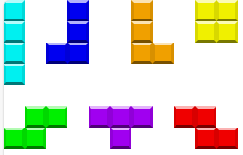
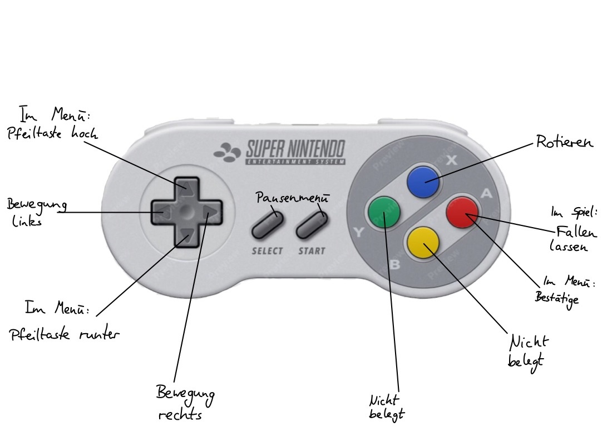

<!-- Table of contents -->
# Inhalt
- [Motivation](#motivation)
- [Spielbeschreibung](#spielbeschreibung)
    - [Spielmechanik](#spielmechanik)
    - [Innovative Funktionen](#innovative-funktionen)
    - [Mobilität und Flexibilität](#mobilität-und-flexibilität)
    - [100 % Spielspaß](#100--spielspaß-garantiert)


## Motivation

Retris basiert auf dem legendären Puzzle-Videospiel Tetris, dass 1985 von dem sowjetischen Softwareingenieur Alexey Pajitnov entwickelt wurde. Es wurde von mehreren Unternehmen für verschiedene Plattformen veröffentlicht.  Inspiriert von dem zeitlosen Klassiker, bietet Retris ein vertrautes Gameplay, das durch moderne Technologie und einzigartige Features bereichert wird. Retris wird mit SNES-Controllern gesteuert und kann im Zwei-Spieler-Modus gespielt werden.


# Spielbeschreibung

Es wird mit sieben verschiedenen Steinen gespielt, die wiederum aus vier gleichen Quadraten aufgebaut sind.
Diese Steine senken sich nach dem Spielstart einzeln von oben nach unten durch das rechteckige Spielfeld, das 10 Quadrate breit und 20 Quadrate hoch ist. Die Steine müssen vom Spieler am Boden zu lückenlosen, waagrechten Reihen zusammengesetzt werden. Der Spieler kann die Steine während des Fallens solange um 90° drehen, bis sie entweder am Grunde des Spielfeldes angelangt sind oder auf einem anderen Stein aufsitzen.

Ist die Abwärtsbewegung eines Steines zum Stillstand gekommen, fällt der nächste Stein von oben herab.
Die Reihenfolge, in der die Steine aufeinander folgen, ist vollkommen wahllos, d. h. dem Zufall überlassen. Im normalen Modus wird der nächste Stein jedoch in einem Vorschaufenster angezeigt.



## Spielmechanik:
In Retris geht es darum, die Blöcke, sogenannte Tetrominos, geschickt zu stapeln, um vollständige Reihen zu bilden und Punkte zu sammeln. Steuern Sie die fallenden Blöcke mit Ihrem Controller und passen Sie sie so an, dass sie perfekt in die bestehenden Lücken passen. Je mehr Reihen Sie auf einmal vervollständigen, desto mehr Punkte verdienen Sie!

Punktesystem:
-
In NINTENDOs Spielen für NES, Game Boy und Super NES wurden die Punkte nach folgender Formel errechnet:
```
40 * Level für eine volle Reihe
100 * Level für zwei Reihen
300 * Level für drei
1200 * Level für vier Reihen
```
Nach einer bestimmten Anzahl an Reihen, die der Spieler gelöscht hat - in unserem Falle 10, gelangt er ins nächste Level, was sowohl eine erhöhte Fallgeschwindigkeit der Steine als auch eine höhere Punktzahl für vervollständigte Reihen bedingt (siehe oben).

Die Tastenbelegung der Controller sieht folgende Funktionen vor:
-

- A : Im Spiel wird bei betätigen der Block fallen gelassen und im Menü wird die Eingabe bestätigt
- B : nicht belegt
- X : Rotieren des Blocks
- Y : nicht belegt
Pfeiltasten :
- links : Bewegung des Retrominos nach links
- rechts : Bewegung des Retrominos nach rechts
- oben : Pfeiltaste nach oben bewegt die Auswahl nach oben
- unten : Pfeiltaste nach unten bewegt die Auswahl nach unten

Start Knopf : Stoppen des Spiels, Pause
Select Knopf : Stoppen des Spiels, Pause
R1 : nicht belegt
L1 :  nicht belegt



Spielende:
-
Wenn das Spielfeld mit unvollständigen Reihen bis zum oberen Rand gefüllt ist, so dass ein folgender Stein nicht mehr nach unten fallen kann, ist das Spiel zu Ende

---
### Innovative Funktionen:
Retris bietet eine Vielzahl von innovativen Funktionen, die das Spielerlebnis bereichern. Von einem eingängigen Soundtrack, der die Atmosphäre belebt, bis hin zu einem Zwei-Spieler-Modus, der es Ihnen ermöglicht, gegen Freunde oder Rivalen anzutreten, bietet Retris eine Vielzahl von Möglichkeiten, das Spiel zu genießen.

### Mobilität und Flexibilität:
Dank seiner tragbaren Hardware und mobilen Stromversorgung können Sie Retris überallhin mitnehmen und spielen, egal ob Sie unterwegs sind oder zu Hause auf dem Sofa entspannen. Das kompakte Design und die austauschbaren Controller machen Retris zu einem idealen Begleiter für unterwegs.

### 100 % Spielspaß garantiert:
Mit seinem einzigartigen Gameplay, innovativen Funktionen und grenzenloser Spielfreude ist Retris das Spiel für alle, die das Retro-Feeling lieben und gleichzeitig die Zukunft des Gamings erleben wollen.

Bereit, Ihre Retrominos zu stapeln und die Herausforderung anzunehmen? Dann bleibt nur eins - `Auf die Blöcke, Fertig, Los!`